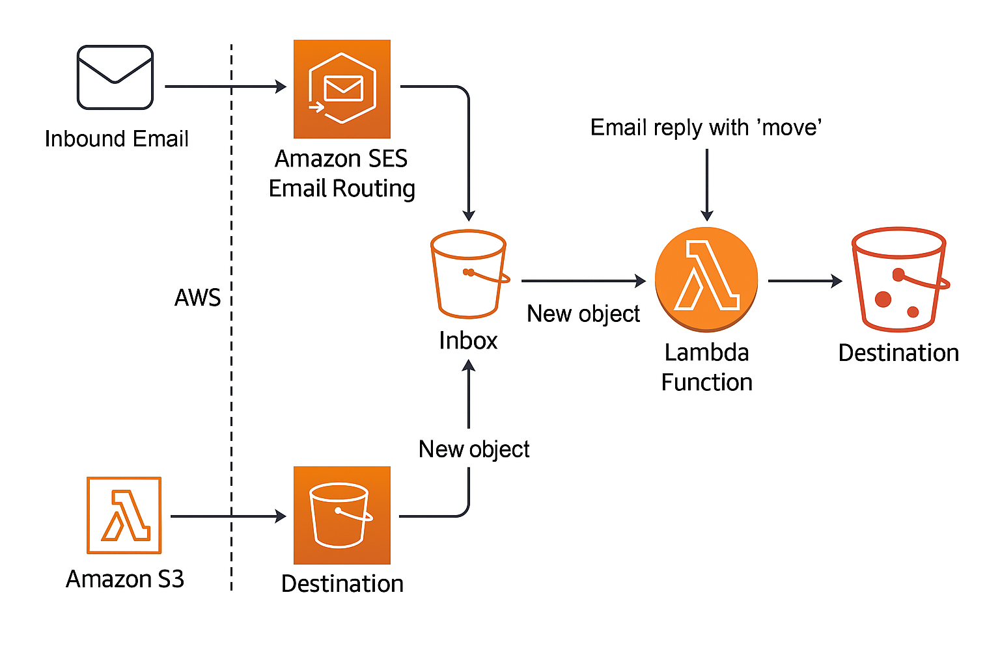

# AWS-serverless-email-triggered-file-mover

This project lets users upload a file to a public website. After uploading, they receive an email with the file info. If the user replies to that email with `move`, the file is moved from one S3 bucket to another.

### Architecture

### Technologies Used

- **Amazon S3** - File storage (public upload + inbox bucket)  
- **Amazon SES** - Send and receive email  
- **Amazon Lambda** - Handle email replies and move files  
- **Amazon S3 Events** - Trigger Lambda on email reception  
- **IAM Roles and Policies** - Secure access between services  
- **Route 53** - Custom domain DNS  

### Domain & Email Setup

1. **Purchase a Domain** (Namecheap provides domain at a very low cost, good for learning purpose)  
   Buy a domain (e.g., `yourdomain.online`) and configure its DNS in Route 53.

2. **Verify Domain in SES**  
   Go to **SES > Verified Identities**.  
   Add domain: `yourdomain.online`.  
   To verify ownership of the domain, you'll need to configure DKIM in the domain's DNS settings.  
   The CNAMEs provided in that page need to be added to your domain DNS setting.  
   After you've added those things in your domain DNS, it'll take some time to get the domain verified.

3. **Create a Verified Email**  
   Use SES to verify a recipient email (e.g., `yourname@gmail.com`) for testing.

4. **Create an idenity for sending the mail**  
   After your domain is verified successfully, you can create an idenity for email such as `upload@yourdomain.online` (No need to buy it from your domain provider!).  
   Since `yourdomain.online` is already verified, no need to verify this email.

### Bucket creation

There will be total 3 buckets:

1. `upload-bucket` : where you upload a file  
2. `email-inbox-bucket` : On uploading a file to upload bucket, you get an email to your verified recipient email  
3. `move-bucket` : Once you reply `move` to that email, the file will be moved here

### SES: Receiving Emails to S3 Bucket

1. **Create S3 Inbox Bucket**  
   Name: `email-inbox-bucket`  
   Enable S3 Event Notifications for `ObjectCreated` events. You'll need to attach a Lambda to that event.  
   Sometimes S3 shows inconsistency for triggering the Lambda. For that, you can enable Amazon EventBridge for that bucket and set rule in EventBridge service. The Lambda function should be written based on the method you use.

2. **Create SES Receipt Rule Set**  
   Rule Name: `SaveToInboxBucket`  
   Recipient: `upload@yourdomain.online`  
   Action: **S3** — save incoming emails to `email-inbox-bucket`

3. **Set Active Rule Set**  
   Go to **SES > Rule Sets** and activate the one you just created.

4. **Lambda Function for receiving email on uploading file to**

5. To allow SES for putting object into the bucket a [policy](./ses_policy_for_putting_object.json) needs to be attached.

### Route53 set up

To use a custom domain and receive emails like `upload@yourdomain.online`, we configured Route 53 as the DNS manager for the domain.

**Key Records:**

- **NS Record**: Delegates DNS control from Namecheap to AWS Route 53. These values must be copied into Namecheap’s DNS panel. Add them to custom DNS.  
- **MX Record**: Directs incoming email to Amazon SES so that it can receive emails sent to `upload@yourdomain.online`.

### Lambda function for receiving mail on uploading a file

[click here](./receive_mail_on_upload.py)  
Add required environment variables

### Lambda function to move the file from upload-bucket to move-bucket when you reply `move` to the mail

[click here](./move_file_on_reply.py)  
Add required environment variables

### IAM Policies

#### Lambda Execution role

Attach the folloeing execution policy to the Lambda role  
[click here](./iam_lamba_role_policy.json)

### S3 Bucket Permissions

You may encounter error in bucket operations, ensure that the bucket has necessary policies attached.

### Email Workflow

- User uploads a file to `upload-bucket`
- Lambda A sends email via SES:  
  Subject: `New file uploaded`  
  Body: `https://upload-bucket.s3.amazonaws.com/your_file.txt`  
  Reply instructions
- User replies with `move`
- SES Rule saves the reply to `email-inbox-bucket`
- Lambda B triggered by S3 event reads email
- If `'move'` keyword found, file is copied to `move-bucket`

### Environemnet Variables that you need to add

- `INBOX_BUCKET` - bucket where you store incoming mails  
- `UPLOAD_BUCKET` - bucket where you manually upload files  
- `DEST_BUCKET` - bucket in which you move the file  
- `TO_EMAIL` - verified email where you want to receive mail after uploading file  
- `FROM_EMAIL` - the sending email (`upload@yourdomain.com`)

### Debugging Tips

Use **CloudWatch** service to check if any error occurs in the Lambda.  
If you see the Lambda not getting triggered, ensure you attached event notification or necessary policies to it.

### Author

**Indrajit Ruidas**  
📧 [Mail me](mailto:indrajitruidas8436@yahoo.com)  
🔗 [LinkedIn](https://linkedin.com/in/indrajitruidas1225)
